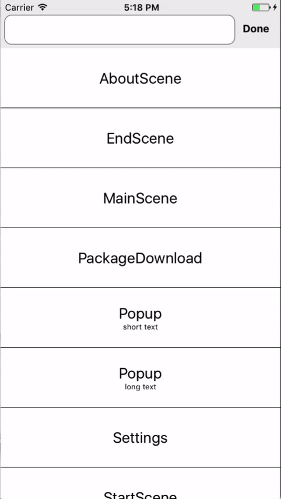
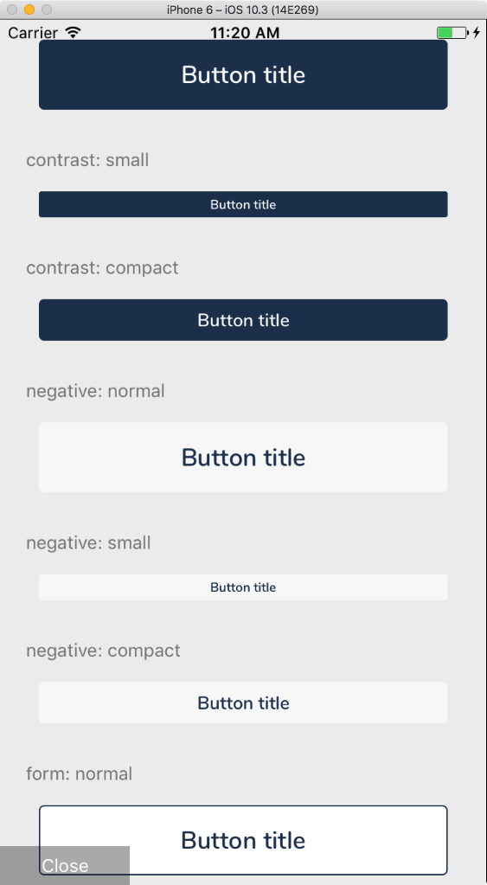

# react-native-component-viewer
A searchable list of components or scenes in your app. Handy for tweaking layout or design without needing to navigate your
app to get there. 

Especially useful for accessing screens that are hard to get to, or for testing the design of screen in specific difficult-to-test situations (e.g. server failure).



# Installation

This is a pure JavaScript library, so there's no need to run `react-native link` or manually add any frameworks or libraries.

```
npm i -S react-native-component-viewer
```

- You may need to close and restart the React Native packager.

# Usage

This library does not assume any specific navigation library is in use. As a result it can be configured for us with [react-navigation](https://github.com/react-community/react-navigation), [react-native-router-flux](https://github.com/aksonov/react-native-router-flux), and others.

## Usage in react-native-router-flux

Here's how to use it in react-native-router-flux:

- First, add the Scene to your list of scenes at the root of your app:

```js
import {ComponentViewer} from 'react-native-component-viewer';

//.. other imports

class MyRootComponent extends React.Component {
  render() {
    return <Scene key="MyRootScene">
      {/* Insert line below.. */}
      <Scene key="ComponentViewer" hideNavBar={true} component={ComponentViewer}/>
    </Scene>
  }
}
```

- Then, at the point you want to show the debug list UI (e.g. if your in-app settings), call `Actions.ComponentViewer({onClose: Actions.pop})`.

The `onClose` prop above runs the function that closes the list UI when the `Done` button is pressed on the UI.

Example:
```js
<TouchableHighlight onPress={()=>Actions.ComponentViewer({onClose: Actions.pop})}>
    <Text>Click to view scenes</Text>
</TouchableHighlight>
```

When you first run this you'll get an empty list. You need to manually register each screen with the system (along with their test prop data) before you can start.

> Other navigation systems will be similar - just make sure to pass a function that closes the list as the `onClose` property of the `<ComponentViewer>` component. This'll ensure the `Done` button on the list
returns to your previous page.

# Registering test screens

On each screen you want to test, add the following:

```js
import {addSceneTest} from 'react-native-component-viewer'; // <-- Add this import

class MySceneComponent extends React.Component {
  //... your scene component here
}

// Add a test scene.
addTestScene(<MySceneComponent
  myProp1={'test data'}
  myProp2={['more','test','data']}
/>,
{name: 'MySceneComponent'},
);
```

You can add the same component several times with different data. To do this, add a `title` property to the the second parameter to `addTestScene`:

```js
addSceneTest(<MySceneComponent items={[]}/>, {name: 'MySceneComponent', title: 'Empty'});

addSceneTest(<MySceneComponent items={['more','test','data']}/>, {name: 'MySceneComponent', title: 'Three items'});
```

## Making space for header and footer bars

In real app, your screens will normally have a header (and perhaps a footer). This means your actual component has a smaller space to render in.

To support this there's an optional property `wrapperStyle` on the second parameter to `addSceneTest`. This is a standard React Native View style.

Use the `padding` properties to adjust the rendering inset to your scene. You may want to store the style somewhere central in your app so
you don't have to type it out each time you use `addTestScene`. 

Example:

```js
addSceneTest(<MySceneComponent items={['more','test','data']}/>, 
{ 
  name: 'MySceneComponent',
  title: Three items', 
  wrapperStyle: {paddingTop: 44, backgroundColor: 'black'}),
}
```

# Registering Test Components

When testing acomponent such as a Button, you'll most likely want to view all the possible states of the button on a single screen

For example:



To do this use the `addComponentTest` method.

For example:

```js
import {addComponentTest} from 'react-native-component-viewer'; // <-- Add this import

// add tests
const wrapperStyle = {width: 200}; // style of container holding the component - useful for constraining to different sizes
addComponentTest(
      <Button type={'large'} title={'Button title'} />,
      {
       name: 'Button',
       title: 'Large button',
	    wrapperStyle,
	   }
    )
```

Multiple tests for a single component appear in the ComponentViewer list as a single entry. Tapping the entry displays a ScrollView containing all your tests.
 
## Usage with Redux

If you're using the `react-redux` `connect` method, make sure you pass the 'unconnected' version of the component to `addTestScene`, e.g.:

```js
class MyComponent extends React.Component {
	//... 
}

export default connect(
	state => ({
		//.. mapStateToProps
	}),
	dispatch => ({
		//.. mapDispatchToProps
	})(MyComponent);
	
// we export the connected component, but pass the
// unconnected component to addTestScene
addTestScene(<MyComponent {...testData}/>);
```

This way you can make sure your test scenes are completely independent of the Redux state.


